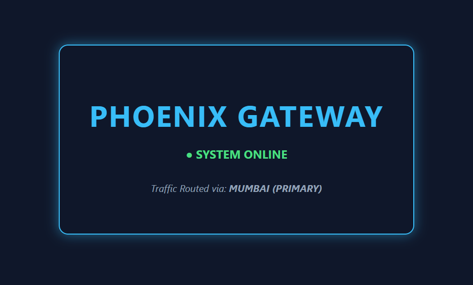
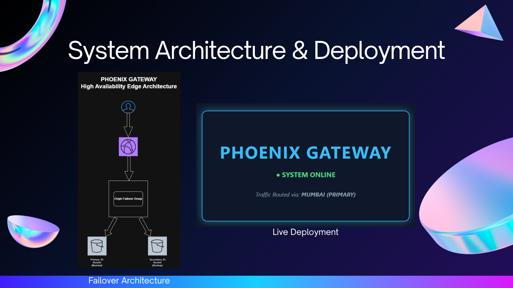

<div align="center">

# 🔥 Phoenix Gateway
### High Availability Edge Architecture on AWS
### *Never goes down. Always delivers.* ⚡

[](https://aws.amazon.com/)
[](https://aws.amazon.com/s3/)
[]()
[]()

</div>

---

## ⚡ Live System Preview

<div align="center">

</div>

> 🟢 **SYSTEM ONLINE** — Traffic Routed via: **MUMBAI (PRIMARY)**

---

## 🏗️ Architecture & Deployment

<div align="center">

</div>

<div align="center">

</div>

```
User
 ↓
AWS CloudFront (Global CDN Edge Delivery)
 ↓
Origin Failover Group
 ↙              ↘
Primary S3        Secondary S3
Bucket            Bucket
(Mumbai)          (Backup)
```

> If Mumbai (Primary) fails → traffic automatically switches to Backup. Zero downtime. ✅

---

## 🌐 What is Phoenix Gateway?

> *An infrastructure that rises from failure — every single time.*

Phoenix Gateway is a **high-availability edge architecture** built on AWS, designed to eliminate single points of failure. It mirrors the kind of resilient, production-grade infrastructure used by enterprise systems worldwide.

---

## ☁️ Tech Stack

| Service | Role |
|---|---|
| ☁️ **AWS CloudFront** | Global CDN — delivers content from edge locations worldwide |
| 🪣 **Amazon S3 (Primary)** | Mumbai origin — serves live traffic |
| 🪣 **Amazon S3 (Backup)** | Secondary origin — automatic failover target |
| 🔀 **Origin Failover Group** | Monitors primary health & switches automatically |
| 🔐 **AWS IAM** | Secure access policies between services |

---

## ✨ Key Features

- 🚀 **Zero single points of failure** — dual S3 origin failover
- 🌍 **Global edge delivery** — CloudFront CDN serves from nearest location
- ⚡ **Automatic failover** — switches to backup with no manual intervention
- 🔐 **Secure by design** — IAM policies control all access
- 📊 **Enterprise-grade resilience** — simulates real production HA patterns
- 🟢 **Live system status** — real-time traffic routing indicator

---

## 🔄 How Failover Works

```
Normal State:
User → CloudFront → Primary S3 (Mumbai) ✅

Failover State:
Primary S3 goes down ❌
       ↓
CloudFront detects failure automatically
       ↓
Traffic rerouted to Secondary S3 (Backup) ✅
       ↓
User experiences zero downtime 🟢
```

---

## 📂 Project Structure

```
phoenix-gateway-aws/
│
├── primary-origin/
│   └── index.html               # Primary S3 website content
│
├── secondary-origin/
│   └── index.html               # Backup S3 website content
│
├── website-preview.png          # Live system screenshot
├── phoenix-gateway-architecture.png  # Architecture diagram
├── 2.png                        # Deployment overview
└── README.md
```

---

## 💡 What I Learned

- Designing **high-availability cloud architecture** from scratch
- Configuring **CloudFront with Origin Failover Groups**
- Setting up **redundant S3 origins** for zero-downtime resilience
- Understanding **CDN edge delivery** and global traffic routing
- Simulating **enterprise-grade infrastructure** patterns on AWS

---

## 👩‍💻 Built By

<div align="center">

**Yashvi Thakar** — Cloud & DevOps Engineer

[](https://www.linkedin.com/in/yashvithakar/)
[](https://github.com/yashvi-create)

*Build. Automate. Repeat.* ☁️✨

</div>
