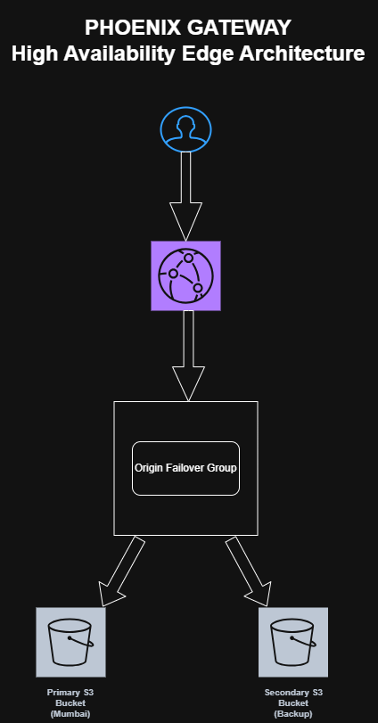

# Phoenix Gateway

## High Availability Edge Architecture on AWS

Phoenix Gateway is a cloud infrastructure project designed to demonstrate high availability, CDN-based edge delivery, and origin failover routing using AWS services.

---

## Architecture Overview

Users access the application through Amazon CloudFront, which routes traffic to a resilient origin failover group backed by multiple Amazon S3 buckets.

### Core Features

- Global CDN delivery using Amazon CloudFront
- Multi-origin failover routing
- Primary and secondary S3 origin architecture
- High availability cloud design
- Static website hosting
- Infrastructure-focused deployment

---

## AWS Services Used

- Amazon CloudFront
- Amazon S3
- AWS IAM

---

## Architecture Diagram

Upload architecture image here.

---

## Learning Outcomes

This project helped demonstrate:

- CDN architecture concepts
- Origin failover configuration
- High availability infrastructure design
- AWS cloud deployment fundamentals
- Edge content delivery workflows

---

## Project Status

System Online
Traffic Routed via Mumbai (Primary)
